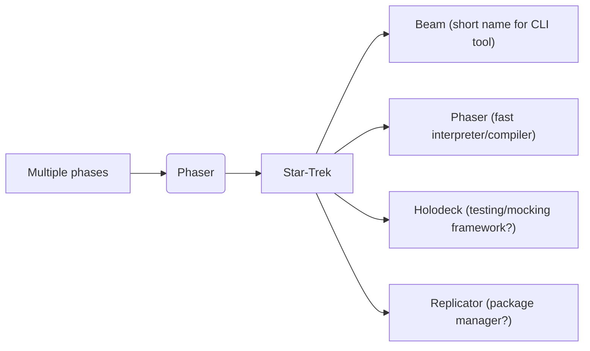

# AI Agent Guidelines
This document provides guidance for AI assistants.

## Overview
Photon is an experimental systems programming language implemented in Rust.
It implements a traditional compilation pipeline combining Rust-like safety with Zig-style compile-time features.
This workspace contains the source code for the all-in-one CLI tool named `beam` for the Language.
Beam manages all aspects of the build process, including compilation, testing, and packaging.

Notable components (crates) in this workspace:
- The root `photon` crate is the all-in-one CLI tool (`beam`)
- The compiler AKA `phaser`
- TBD: An LSP server
- TBD: package manager `replicator`
- TBD: Testing framework `holodeck`

The language takes a staged interpratation approach where code is evaluated at multiple phases with capability based design and first class Meta-Object Protocol (MOP) and compile-time introspection abilities. 

## Project nomencluture (first draft) 
Word associations:

For consitency and maybe branding we want to keep evocing the same world of ideas. 
The above are current tentative first draft and I'm open to suggestions and future revisions the nomencluture.


## Code Conventions for the project
The project is implemented in Rust.

### Naming
We use Rust conventions for naming, e.g.:

- Types: `PascalCase` (e.g., `TokenType`, `AstNode`)
- Functions/variables: `snake_case`
- Constants: `SCREAMING_SNAKE_CASE`

## Development Workflow
### Common Commands

```bash
cargo run <file.photon>      # Compile a Photon file
cargo test               # Run all tests
cargo clippy             # Lint code
cargo fmt                # Format code
cargo check              # Fast compile check
```

### Testing Strategy
- **Unit tests**: `#[cfg(test)]` within each rust module (i.e as close to the souce code as possible, unless the module is too big)
- **Integration tests**: `**/tests/` directory for each crate
- **Language tests**: `/Language_tests/*.photon` files in project root sub-directory
- **Test error cases first** before implementing success paths


## Common Patterns
### Error handing
- `eyre` for a better user experience in Application code (for our cli tools).
- `error-stack` for library code (for better diagnostics)

```rust
// Always propagate errors with ?
fn process_tokens(&mut self) -> PhaserResult<Vec<Token>> {
    let mut tokens = Vec::new();
    while !self.is_at_end() {
        tokens.push(self.scan_token()?); // Use ? operator
    }
    Ok(tokens)
}
```

#### Error Type Conversion

```rust
// Implement From traits for seamless conversion
impl From<LexerError> for PhaserError {
    fn from(err: LexerError) -> Self {
        PhaserError::Lexer(err)
    }
}
```

### Enum-Based Design

```rust
// Prefer enums over booleans or strings
pub enum TokenType {
    Identifier,
    Number,
    String,
    // ... variants
}

// Not: pub struct Token { kind: String, ... }
```

## What NOT to Do
❌ **Don't use `.unwrap()` or `.expect()`** in production code
❌ **Don't skip compilation phases** or merge phase logic
❌ **Don't panic** - use `PhaserResult<T>` for all fallible operations
❌ **Don't bypass error handling** - every error needs source position
❌ **Don't create deep module nesting** - keep structure flat (max 2-3 levels)

## Performance Considerations

- **Minimize allocations** in hot paths (lexer, parser)
- **Design for incremental compilation** - structure for caching
- **Profile before optimizing** - measure, don't guess
- **Justify abstractions** - every layer must provide clear value

## Questions to Ask Before Implementing

1. Which compilation phase owns this functionality?
2. What error cases exist? How do we report them with source positions?
3. Does this maintain the zero-dependency policy?
4. Does this respect phase boundaries?
5. How will this be tested (unit + integration)?
6. Is the implementation minimal and focused?

## Additional Resources

- `README.md` - Project overview and setup

---

**Remember**: This is a learning project focused on compiler design fundamentals. Prioritize clarity, correctness, and architectural integrity over premature optimization.
