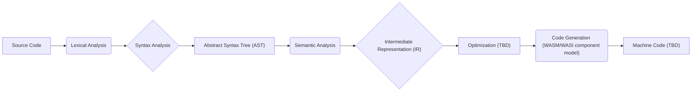

# Staged interpreter & compiler for Photon

## High level Architecture
Traditional pipeline design


## Interpreter vs. Compiler modes
The compiler *is* a staged interpreter whereby we either evaluate the source code at run time, or we defer by transpiling to wasm. 
Staging is a core design tenent with 1st class support for operations.
Consider maintaining contexts to facilitate multi-stage support. 


## File Structure Reference

```text
phaser/
├── src/
│   ├── lib.rs              # Main exports, PhaserResult definition
│   ├── main.rs             # CLI entry (minimal)
│   ├── lexer/              # Phase 1: Tokenization
│   ├── parser/             # Phase 2: AST construction
│   ├── analysis/           # Phase 3: Semantic analysis
│   ├── comptime/           # Phase 4: Compile-time evaluation
│   └── codegen/            # Phase 5: Code generation
├── tests/                  # Integration tests
├── samples/                # Example .ph files
│   ├── test.ph
│   ├── test_comptime.ph
│   └── test_errors.ph
└── Cargo.toml
```

